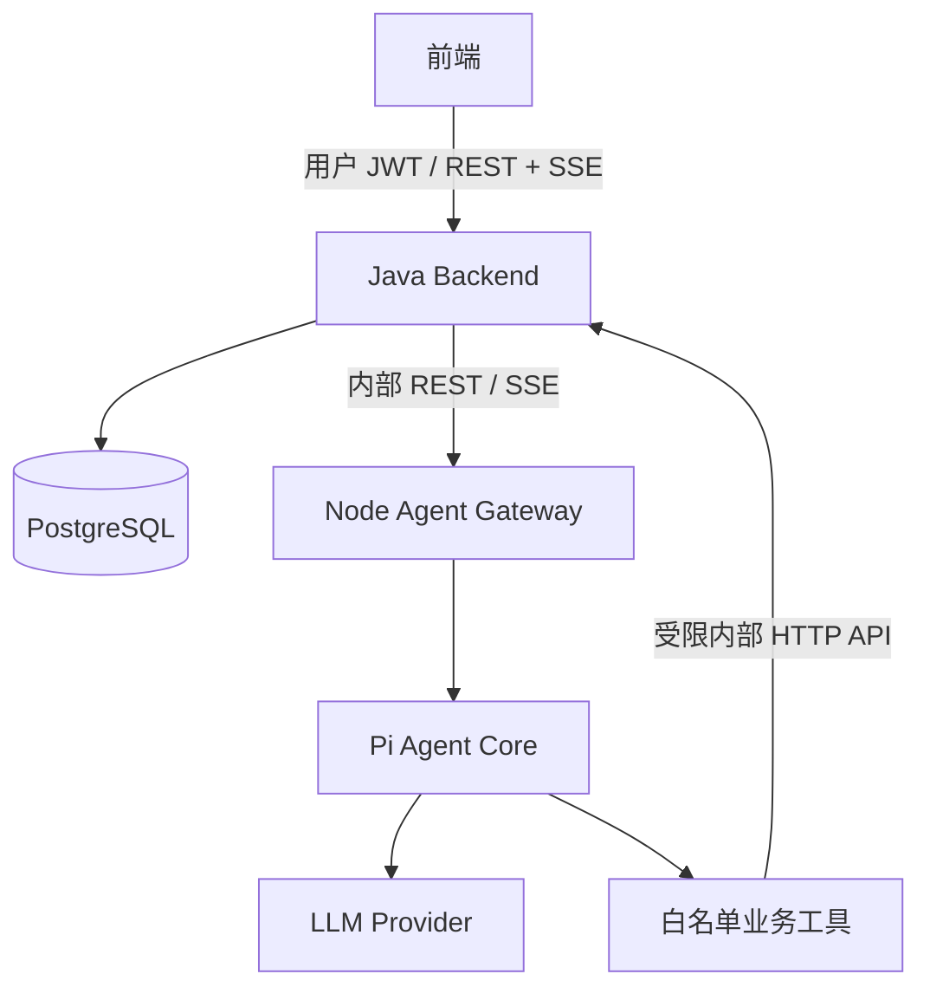

# Pi Agent 接入剧本创作系统：架构方案与执行策略

更新日期：2026-10-05。

适用项目：`D:\desktop\screenplay-agent-backend`；Pi 源码：`D:\desktop\screenplay-agent-backend\pi-agent`。

本文基于本地源码审阅及已经运行的示例编写。标为“已实现”的内容位于 examples 中；标为“计划”的接口、数据表和文件尚未加入 Java 生产代码。验证记录来自此前完成示例时的检查，本次仅整理文档。本文用于后续实施，不代表真实模型、数据库回调和前端已经全部接通。

## 1. 决策与第一阶段目标

采用独立 Node/TypeScript Agent Gateway，内部使用 Pi Agent Core；Java 继续作为业务、权限和数据边界。Java 与 Gateway 通过 REST 提交任务，通过 SSE 接收事件。

第一条业务验收链路：

> 已登录用户选择自己的一个项目和一份短剧本，提交“分析并给出修改建议”；Agent 从 Java 读取真实素材，生成建议并保存为待审核草稿；前端看到工具进度和文本增量；正式剧本只在用户采纳后创建新版本。

先使用 mock LLM 完成 Java 数据闭环，再启用真实模型。先完成这条链路，再扩大到长剧本、五类专业能力与多 Agent。

| 决策 | 选择 | 原因 |
|---|---|---|
| 运行方式 | 独立 Node 服务 | 会话、并发、取消、超时及部署边界清晰 |
| Pi 入口 | `@earendil-works/pi-agent-core` 的 `Agent` | 可以只注册业务工具，MVP 无需 CLI |
| 模型访问 | `pi-ai` 的 `createModels()` + provider factory | 与这份本地源码的实际导出一致 |
| 控制协议 | HTTP REST | 创建 session、提交 run、查询、取消 |
| 流式协议 | SSE | 适合文字增量与工具事件，支持重连游标 |
| 业务数据 | Java API 管理 | 复用组织隔离、业务校验、事务与审计 |
| 写入策略 | 先保存草稿，再由用户采纳 | 保留来源版本，避免覆盖用户修改 |
| 初期部署 | 单实例 Gateway | 先明确生命周期；扩容时再增加队列、租约与共享事件日志 |

## 2. 本地项目事实与容易踩的坑

### 2.1 Pi 源码事实

已阅读 `pi-agent/README.md`、`packages/agent/README.md`、`packages/agent/src/agent.ts`、`agent-loop.ts`、`types.ts`，并检查 Harness/session、CLI RPC 和 orchestrator。

- 本地 core 包清单版本为 `0.80.6`，要求 Node >=22.19.0。生产依赖应锁定实际验证过的源码 commit；不能仅凭版本号认为 npm 上的包与本地 checkout 完全相同。
- `packages/agent/README.md` 的旧 `getModel` 初始化示例与当前源码根入口不一致。当前使用 `createModels()`；旧全局 API 位于 `@earendil-works/pi-ai/compat`。
- `Agent` 提供 `prompt()`、`subscribe()`、`abort()`、`waitForIdle()`、工具执行和消息状态；HTTP 服务、业务授权和持久化需要应用封装。
- `Agent.sessionId` 是传给 provider 的缓存提示，不等于数据库 session，也不负责用户隔离。
- `prompt()` 可能正常 resolve，同时把失败记录在 `state.errorMessage` 或最终 assistant 的 `stopReason` 中。成功判定必须检查最终状态。
- 同一个 Agent 忙时会拒绝新的 prompt；应用仍需 session 级并发控制。
- core 还导出了 `AgentHarness`、Session、JSONL/内存仓储和压缩能力。Harness 的手动 `compact()` 不等于应用已经有自动压缩调度。
- Pi 不内置文件、进程和网络权限沙箱；`NodeExecutionEnv.cwd` 不是目录隔离。
- CLI RPC 是 stdin/stdout 上的 LF 分隔 JSONL，不是标准 JSON-RPC 2.0。
- `packages/orchestrator/README.md` 明确标记 experimental，第一版不依赖其业务稳定性。

### 2.2 Java 现状

Java 目标版本为 21，使用 Spring Boot 3.5.0、Spring MVC、Spring Security、PostgreSQL，并已有 STOMP/WebSocket 通知基础设施。

已经存在：项目、剧本版本、场景、元素、组织隔离、规则解析和 Markdown 导出。现有入口统一前缀 `/api/v1/screenplay`：

```text
GET  /projects/{projectId}
GET  /projects/{projectId}/scripts
GET  /scripts/{scriptId}
GET  /scripts/{scriptId}/scenes
GET  /scripts/{scriptId}/elements
POST /projects/{projectId}/scripts
POST /scripts/{scriptId}/analyze
```

注意以下实施约束：

1. `AnalysisTransactions.replace()` 在 `REQUIRES_NEW` 事务内调用 `AgentClient.analyzeScript()`；外围 `AnalysisLock` 还有 PostgreSQL advisory transaction lock。直接换成远程 LLM 会在生成期间占用两条数据库连接。
2. 保留当前规则分析入口，为 Agent 新增异步业务流程；不要把长耗时网络请求塞入现有分析事务。
3. 当前组织隔离不等于已经实现项目成员 ACL；项目权限策略必须由 Java 明确执行。
4. `SceneElement` 中的 CHARACTER 是解析结果，不是完整人物设定库。
5. `ScriptVersion` 当前没有 `@Version`、内容 revision 或项目当前版本指针。`versionName` 是展示名称，不是并发版本号。
6. 剧本上限为 500,000 字符；示例读取工具只接受 12,000 字符，超过范围必须按场景读取。
7. 当前 JWT Filter 把 Bearer 当作应用 JWT；示例中的共享服务 Token 不能直接调用现有用户接口。
8. `CurrentUserProvider` 依赖线程中的 SecurityContext。异步执行前，在请求线程捕获用户、组织及已授权范围。

历史文档中的“先实现 Java-only MVP”是上一阶段策略；该模块已存在，本计划承接下一阶段 Agent 集成。

## 3. 推荐架构与职责



| 层 | 负责的事情 |
|---|---|
| 前端 | 发起任务、展示进度与草稿、停止、重连、采纳结果 |
| Java | 用户/组织/项目授权、剧本与人物事实、任务与草稿落库、版本校验、审计 |
| Node Gateway | Agent 生命周期、profile、上下文组装、工具白名单、事件转换、预算与超时 |
| Pi Core | 多轮模型调用、工具调度、Agent 消息与事件 |
| Java 内部适配接口 | 将受限工具请求映射到已授权的业务 service |

Java 发起 Agent run 后释放请求线程和数据库事务。工具回调由独立 HTTP 请求进入 Java，不依赖原来的请求线程继续存活。

### 3.1 协议取舍

| 方式 | 适用范围 |
|---|---|
| REST + SSE | 当前主方案；REST 控制，SSE 推送 |
| WebSocket/STOMP | 将来需要频繁双向交互时使用；可复用已有通知设施转发相同事件 |
| CLI 子进程 | 本地实验或确实需要完整 coding-agent 行为的受控 worker |
| JSON-RPC | 当前没有新增一套协议的必要 |

若采用 CLI，需要额外管理进程、UTF-8/LF 分帧、stderr、退出码、取消和权限。CLI 的命令成功响应可能只表示已接受，不能当作任务完成。

## 4. 已交付的可运行 MVP

目录：`D:\desktop\screenplay-agent-backend\examples\pi-agent-gateway`。

```text
examples/pi-agent-gateway/
├─ README.md
├─ package.json
├─ tsconfig.json
├─ src/
│  ├─ server.ts       REST、运行状态、SSE、鉴权、限额
│  ├─ runtime.ts      Pi 初始化、mock/live provider、事件转换
│  └─ tools.ts        get_screenplay、save_draft、Java HTTP 适配
├─ scripts/
│  └─ smoke.ts        无密钥的集成验证
└─ examples/java/
   └─ AgentGatewayClient.java
```

已实现并验证：

- [x] 真实 Pi runtime + faux LLM provider + 内存业务数据的完整工具循环。
- [x] 创建会话、提交 run、查询状态、SSE、取消。
- [x] SSE 递增事件 ID、重放、心跳和连接数量限制。
- [x] 相同请求幂等、同会话并发冲突、会话用户隔离。
- [x] 工具次数、请求大小、事件缓存、HTTP 超时和运行时长限制。
- [x] TypeScript 检查及 mock 集成验证通过。
- [x] JDK 客户端已实际连接本 Gateway，收到工具事件、文本增量和 `run.completed`。

尚未完成：

- [ ] Java 内部读取/保存接口及其认证链。
- [ ] Spring 对外 Agent Controller 和 SSE 转发。
- [ ] 真实模型联调与质量验收。
- [ ] PostgreSQL 会话、任务、消息、事件、草稿持久化。
- [ ] 前端页面、正式草稿采纳流程。
- [ ] 长剧本上下文、自动摘要、专业任务与多 Agent。

mock 回答是预设演示；mock 保存发生在内存。不能把这两项解释为已经完成真实剧本分析或数据库写入。

### 4.1 本地运行命令

首次需要安装 Pi 的锁定依赖时执行：

```powershell
Set-Location D:\desktop\screenplay-agent-backend\pi-agent
npm ci --ignore-scripts --no-audit --no-fund
```

启动示例：

```powershell
Set-Location D:\desktop\screenplay-agent-backend\examples\pi-agent-gateway
npm run check
npm run smoke
$env:AGENT_GATEWAY_TOKEN = 'local-demo-change-this-token'
npm start
```

另开终端执行 Java 示例：

```powershell
Set-Location D:\desktop\screenplay-agent-backend\examples\pi-agent-gateway
$env:AGENT_GATEWAY_TOKEN = 'local-demo-change-this-token'
java '-Dfile.encoding=UTF-8' examples/java/AgentGatewayClient.java
```

这里的凭据仅为本地演示示意。Gateway 默认绑定 `127.0.0.1:3001`。Java 独立示例兼容 JDK 17+，现有 Spring 项目的编译与测试仍要求 JDK 21。

## 5. 接口契约

### 5.1 Node 已实现接口

除健康检查外，示例要求 `Authorization: Bearer <AGENT_GATEWAY_TOKEN>` 与可信 Java 设置的 `X-Agent-User`。浏览器不持有服务 Token。

| 接口 | 请求 / 响应 |
|---|---|
| `GET /health` | `{ok:true}` |
| `POST /agent/sessions` | `{projectId,screenplayId}` → `{sessionId}` |
| `POST /agent/chat` | `{sessionId,message,clientRequestId}` → 202 `{runId}` |
| `GET /agent/runs/{runId}` | `{runId,status}` |
| `GET /agent/runs/{runId}/events` | SSE；支持 `Last-Event-ID` / `?after=N` |
| `POST /agent/runs/{runId}/cancel` | 请求取消，以终态事件为准 |

同 session 同时执行一次；相同 session + clientRequestId + message 返回同一 run；复用请求键但修改 message 返回 409。当前幂等记录只保留在进程内，正式版需要落库。

为专业任务预留 `POST /agent/tasks`，参数增加 `taskType`、`input`、`outputSchemaVersion`。该接口属于计划，尚未实现。不要增加可以任意指定工具名并绕过运行权限的通用执行端点。

### 5.2 Java 内部接口：下一阶段新增

先实现与示例匹配的两个接口，避免同时改双方协议：

**读取剧本**

```http
GET /internal/agent/projects/{projectId}/screenplays/{screenplayId}
Authorization: Bearer <受限执行凭据>
```

```json
{
  "screenplayId": "123",
  "projectId": "45",
  "title": "雨夜重逢",
  "content": "当前需要处理的短剧本原文",
  "version": 1
}
```

- Java 的 Long ID 映射成 JSON 字符串；示例按字符串严格比较。
- `content` 来自 `rawText`；`title` 可由项目名称或版本名称形成，最大 200 字符。
- `version` 是计划新增的非负整数内容 revision，不能用 `versionName` 替代。
- 第一条链路只使用 <=12,000 字符的短剧本，响应体还受 64 KiB 限制。超长时返回明确错误；不静默截断。
- 大剧本后续新增 `GET /internal/agent/projects/{p}/scenes/{sceneId}`，返回场景和有限前后文。

**保存待审核草稿**

```http
POST /internal/agent/projects/{projectId}/drafts
Authorization: Bearer <受限执行凭据>
Idempotency-Key: <sessionId>:<toolCallId>
Content-Type: application/json
```

```json
{
  "screenplayId": "123",
  "sessionId": "session-uuid",
  "content": "Agent 生成的修改建议或对白草稿",
  "sourceVersion": 1
}
```

成功返回：

```json
{"draftId":"draft-uuid","status":"pending_review"}
```

Java 同时校验组织、用户权限、项目与剧本归属、来源 revision 和请求幂等。相同幂等键、相同内容返回原 draft；相同键、不同内容返回 409。唯一约束必须在数据库中生效，不能仅依靠先查询再插入。

正式版新增 `applicationRunId`、任务类型和结构化结果字段时，Java DTO、Node 类型和工具一起升级；当前示例请求尚无这些字段。run 关联还应来自执行凭据，不能只相信模型可见参数。

随后新增：

| 接口 | 目的 |
|---|---|
| `GET /internal/agent/projects/{p}/characters` | 人物设定与版本 |
| `GET /internal/agent/projects/{p}/context` | 项目摘要、创作约束、用户偏好 |
| `PATCH /internal/agent/projects/{p}/context` | 带 revision 更新已确认上下文 |

示例支持裸 DTO，也兼容 `{code:0,data:...}` 包装；现有 Java 并不统一使用后者。建议本次适配选择裸 DTO。

### 5.3 Java 对前端接口：计划

```text
POST /api/v1/screenplay/projects/{projectId}/agent/sessions
POST /api/v1/screenplay/agent/sessions/{sessionId}/messages
GET  /api/v1/screenplay/agent/runs/{runId}
GET  /api/v1/screenplay/agent/runs/{runId}/events
POST /api/v1/screenplay/agent/runs/{runId}/cancel
GET  /api/v1/screenplay/projects/{projectId}/agent/drafts
POST /api/v1/screenplay/agent/drafts/{draftId}/accept
POST /api/v1/screenplay/agent/drafts/{draftId}/reject
```

Java 从登录身份推导 userId/organizationId，不从浏览器提供的用户头获取。所有 session/run/draft 查询都先做对象归属校验。

Java 创建的业务 run UUID 称为 `applicationRunId`；目前 Node 返回的 ID 称为 `gatewayRunId`。数据库保存两者映射，避免错误假设它们天然相同。前端只使用 Java 的业务 run ID。

## 6. 剧本任务、工具和代码结构

### 6.1 五类能力先做任务 profile

| taskType | 输入 | 建议结构化结果 | 初始写权限 |
|---|---|---|---|
| `analyze_scene` | 场景、前后文、人物目标 | summary、issues、evidence、suggestions | 草稿 |
| `rewrite_dialogue` | 原对白、角色设定、风格要求 | original、proposed、rationale | 草稿 |
| `extract_characters` | 场景或剧本片段 | characters、aliases、evidence | 人物提案 |
| `build_outline` | 题材、创作目标、已确认剧情 | acts、beats、sceneIdeas | 大纲草稿 |
| `check_plot_logic` | 时间线、事件、人物知识 | contradictions、evidence、fixes | 检查报告 |

工具负责可验证的操作：`get_screenplay`、`get_scene`、`get_character_profiles`、`get_project_context`、`save_draft`。模型负责分析、写作和选择何时调用工具。

如果将 `analyze_scene` 封装成子 Agent 工具，子 Agent 不再获得该委派工具自身，且继承收窄的权限与总预算。普通分析不必每次额外发起一个嵌套模型调用。

结果必须经过 schema 校验；证据应包含可追溯的场景/人物 ID 和原文位置。模型输出的 ID 和引用都要验证存在且属于当前项目。

### 6.2 当前源码可用的 Agent 初始化

以下是 live 初始化的最小形式；完整 mock/live 与限额实现见现有 `src/runtime.ts`。本段模型 ID 来自本地 catalog，不保证具体账号可访问。

```typescript
import { Agent } from "@earendil-works/pi-agent-core";
import { createModels } from "@earendil-works/pi-ai";
import { anthropicProvider } from "@earendil-works/pi-ai/providers/anthropic";
import { createScreenplayTools, type SessionScope } from "./tools.ts";

export function createLiveAgent(scope: SessionScope) {
  const models = createModels();
  models.setProvider(anthropicProvider());
  const model = models.getModel(
    "anthropic", process.env.PI_MODEL ?? "claude-haiku-4-5-20251001"
  );
  if (!model) throw new Error("Model absent from local catalog");
  return new Agent({
    sessionId: scope.sessionId,
    toolExecution: "sequential",
    initialState: {
      model,
      systemPrompt: "你是剧本创作助手。读取授权素材后给出建议，修改保存为待审核草稿。",
      tools: createScreenplayTools(scope),
    },
    streamFn: (m, context, options) => models.streamSimple(
      m, context, { ...options, maxTokens: 2048 }
    ),
  });
}
```

### 6.3 工具定义方式

下面展示可复用的工具工厂。注入的读取函数负责 HTTP、授权范围绑定和响应校验；现有 `tools.ts` 已提供具体实现。

```typescript
import type { AgentTool } from "@earendil-works/pi-agent-core";
import { Type } from "@earendil-works/pi-ai";

const parameters = Type.Object({}, { additionalProperties: false });
type Screenplay = {
  screenplayId: string; projectId: string;
  title: string; content: string; version: number;
};

export function getScreenplayTool(
  readAuthorized: (signal?: AbortSignal) => Promise<Screenplay>
): AgentTool<typeof parameters, { version: number }> {
  return {
    name: "get_screenplay",
    label: "读取当前剧本",
    description: "读取会话绑定的剧本素材和版本",
    parameters,
    async execute(_id, _params, signal) {
      signal?.throwIfAborted();
      const screenplay = await readAuthorized(signal);
      return {
        content: [{ type: "text", text: JSON.stringify(screenplay) }],
        details: { version: screenplay.version },
      };
    },
  };
}
```

用户/组织/项目身份由闭包中的授权上下文决定，不出现在模型可修改的工具参数中。工具失败应 throw，由 Pi 生成 `isError` 工具结果；不要返回看起来成功的错误字符串。

### 6.4 从示例提升为独立服务的目标目录

```text
agent-gateway/                    计划新增；当前代码仍在 examples
  src/
    server.ts
    routes/                      session、run、events、cancel
    agent/
      factory.ts                 根据 profile 创建独立实例
      profiles.ts                任务说明、模型、工具权限、输出 schema
      context.ts                 项目事实、摘要、片段组装
    tools/
      read-screenplay.ts
      read-scene.ts
      save-draft.ts
    clients/java-client.ts       固定地址、鉴权、超时、响应校验
    events/projector.ts          Pi 事件到产品事件
    storage/session-store.ts     持久化接口
    policy/run-budget.ts         时间、token、工具、委派配额
  test/
  package.json
  package-lock.json
```

生产服务使用经过验证的 Pi 包或内部构建包、明确依赖和锁文件。当前 tsconfig 源码映射是本地 checkout 演示方式，不作为发布方案。

## 7. 流式协议与 Java 转发

任务提交后立即返回 run ID，再订阅事件。事件在订阅前写入缓存或持久日志，避免丢开头。

```text
run.started
status
tool.started
tool.completed
text.delta
usage
run.completed | run.failed | run.cancelled
```

```text
id: 12
event: text.delta
data: {"version":1,"runId":"...","sessionId":"...","seq":12,"type":"text.delta","data":{"delta":"这个场景的冲突来自"}}

```

Pi 的 `message_update` 内 `assistantMessageEvent.type === "text_delta"` 对应文本增量。`tool_execution_start/update/end` 转换成工具请求、进度和结果状态；只投影允许展示的字段。前端展示操作阶段、简短计划和结果，原始内部推理不作为接口契约。

注意三个不同的“结束”：

1. Pi `agent_end` 是事件结束信号，订阅者异步工作仍可能未完成。
2. `await agent.prompt()` 结束后，仍要检查 errorMessage 和最终 assistant stopReason。
3. Agent 生成成功不代表业务写入成功。要求保存草稿的任务必须由 Java 验证关联 draft 已持久化，才能发送业务 `run.completed`；不能根据模型说“已保存”判定。

当前 mock 示例在工具失败后可能生成一段正常的失败说明，此时 Node run 仍可结束为 completed。正式业务层必须区分“生成完成”和“交付草稿成功”，并增加缺失草稿的验收测试。

当前 `tool.completed` 只包含工具 ID、名称和 isError，不包含 draftId。正式版增加经 Java 持久化确认的 `artifact.created {draftId,status,sourceScriptId,sourceRevision}` 事件，或由 `GET /api/v1/screenplay/agent/runs/{runId}` 返回关联草稿。前端用这些结构化字段展示可审核结果，不能从模型自然语言里提取 draftId。

### 7.1 Java 调用示例

完整可运行实现位于 `examples/pi-agent-gateway/examples/java/AgentGatewayClient.java`，使用 JDK HttpClient：

```java
var client = new AgentGatewayClient(
    URI.create("http://127.0.0.1:3001"), serviceToken, authenticatedUserId);
String sessionId = client.createSession(projectId, screenplayId);
String runId = client.chat(sessionId, "分析场景并保存建议", requestId);
try (var stream = client.openEvents(runId, lastEventId)) {
    stream.consume(event -> {
        // Spring 转发层在这里向 SseEmitter 发送 id/name/data。
        System.out.println(event.event() + " " + event.data());
    });
}
```

Spring MVC 返回 `SseEmitter`；转发工作放在有容量限制的 executor 或 Java 21 虚拟线程配合并发信号量中。仅使用虚拟线程不等于已经限制并发。请求线程先完成授权；worker 不依赖隐式 ThreadLocal 身份。

- 保留 `id`、`event` 和 `data`；业务 run ID 与 gateway run ID 通过服务端映射转换。
- `Last-Event-ID` 只用于游标，不替代权限检查；前端按业务 run ID + seq 去重。
- 浏览器断连关闭上游订阅，但不自动取消 run；“停止”按钮调用 cancel。
- Node 心跳是 SSE 注释，当前 Java 示例解析器会忽略注释。Spring 中间层必须自行发心跳或明确转发注释，不能假设 Node 心跳自然到达浏览器。
- 使用 `text/event-stream`、禁止代理缓冲、配置合理超时与连接上限。
- 当前浏览器用 Bearer 用户 JWT 时，采用 fetch 流式读取或支持 header 的 SSE 客户端。原生 EventSource 不便自定义 Authorization；不要把长期 Token 放 URL。
- 若使用 fetch 自行解析，保留 UTF-8 decoder 和跨 chunk 的行/帧缓冲，不能假设一次网络 read 就是一条事件。

## 8. Session、memory、上下文与持久化

一个项目可以有多个 session，按用户、分支、任务划分；一个 session 内包含多个 run。权威人物和剧情事实由 Java 管理，不能仅存在模型对话摘要中。

上下文组装顺序：

```text
固定系统说明与任务 profile
  + 已授权的项目约束、人物设定、偏好
  + 带来源版本的历史摘要
  + 最近完整对话轮次
  + 当前场景与有限前后文
```

摘要保存来源消息范围及 contextVersion；保留原始消息用于恢复与审计。裁剪时保留 assistant toolCall 与 toolResult 配对。中文 token 预算应使用适配模型的计数或保守估算，不能把 chars/4 当精确值。

### 8.1 计划数据表

| 表 | 关键字段 / 约束 | 实施阶段 |
|---|---|---|
| `agent_sessions` | id、organization_id、user_id、project_id、script_id、gateway_session_id、profile_version | P1 |
| `agent_runs` | id、session_id、gateway_run_id、request_id、request_hash、status、source_revision、parent_run_id | P1 |
| `agent_drafts` | id、run_id、source_script_id、source_revision、content、status、idempotency_key、payload_hash | P1 |
| `agent_messages` | session_id、sequence、完整消息 JSON、run_id；唯一 session+sequence | P4 |
| `agent_events` | run_id、seq、type、payload、created_at；唯一 run+seq | P4 |
| `agent_run_outbox` | run_id、dispatch 状态、attempt、next_attempt_at；或等价的 DB job 调度字段 | P1 |

所有访问都经组织/项目范围查询。数据库迁移机制在新增共享表前确定；当前项目是本地 `ddl-auto:update`，不能把手工建表当可复现发布流程。

`agent_runs` 对 session_id + request_id 建唯一约束；重复键不同 request_hash 返回 409。草稿幂等键应与组织/run 作用域一起建立唯一约束，并校验 payload_hash。

新增整数 `contentRevision`，只在正文变化时递增，不因分析状态改变而递增。当前剧本以新版本追加为主，每条不可变版本可以从 revision=1 开始；采纳草稿创建新 ScriptVersion，保留 sourceScriptVersionId。项目“当前版本”指针若需要，另行定义，不能假设当前已经存在。

### 8.2 运行状态与恢复

```text
queued -> running -> finalizing -> completed
   |          |           |
   +----------+-----------+-> failed
              +-> cancelling -> cancelled
              +-> interrupted
```

这些是计划中的 Java 业务状态；当前 Node 示例只有 running/completed/failed/cancelled。

网络等待不占数据库事务：短事务登记任务/读取版本 → 事务外调用 Node → 短事务保存结果与终态。客户端超时后可使用同一 requestId 查询或重试，不重复创建业务任务。

P1 的 DB outbox/job worker 恢复未派发任务；Node 请求使用稳定幂等键。P4 增加消息 checkpoint、持久事件与重启恢复。worker 崩溃后先标记 interrupted，核对已保存草稿；不能无条件重放有副作用的工具。

多实例前增加 session 租约、fencing token 和共享事件日志。事件先持久化再广播；订阅可能重复，消费端去重。幂等写保障的是同一个明确请求，不承诺跨崩溃的通用 exactly-once 执行。

## 9. 权限、安全与资源策略

### 9.1 服务身份与受限执行凭据

示例采用 loopback + 共享服务 Token + 可信用户头，只适合本地链路验证。接入真实多租户业务前，新增专用内部认证链及明确的执行授权。

执行凭据绑定以下信息：

```text
iss / aud / exp / jti
organizationId / userId / projectId / screenplayId
applicationRunId / sessionId
scopes: screenplay:read, draft:create
```

区分两个方向：Java → Gateway 的凭据 audience 为 Gateway；Node → Java 回调的凭据 audience 为 Java 内部 API。不能用 audience 错误的 Token 跨服务复用。Java 可为每个 run 签发独立的回调凭据，经可信服务通道交给 Node；凭据只存在运行上下文，不进入模型消息或 SSE。

会话创建先验证用户/项目范围；run 创建后才签发绑定 applicationRunId 的执行凭据。Java 在回调时重新检查权限、对象归属、run 状态和 scopes。过期、错误 audience、越权项目、已取消 run 的写入都应拒绝。

### 9.2 工具和系统边界

- 仅注册业务工具；不注册 bash、通用文件读写、任意 URL 请求或动态扩展加载。
- 固定 Java base URL，禁止重定向，限制响应体、输入 schema 和返回字段。
- 场景文本与工具返回是素材，不具备授权效力；提示注入不能改变 scopes。
- Node 以最小权限账户运行，生产使用内网 TLS/mTLS、只读文件系统和出网限制。
- 明文密钥不进源码、工具结果、日志和客户端；日志主要记录 trace/run/tool IDs、耗时、结果状态。
- 当前读取与写入默认顺序执行；写工具即使以后启用并行读，也需顺序和数据库并发保护。

### 9.3 初始资源参数

当前示例：每个 run 120 秒、最多 8 次工具调用、单次 provider 输出 maxTokens=2048；Java HTTP 10 秒超时；读取正文 12,000 字符/响应 64 KiB；一个 session 同时一次 run。

这些是演示默认值，不是已验证的产品容量。正式版增加每用户/组织并发、输入 token、总输出 token、费用配额和队列长度限制。长任务按单独 profile 配置，不通过简单放大所有超时解决。

取消是协作式的：已经提交的草稿可能仍存在。取消表示停止后续执行，不表示自动回滚历史工具写入；前端展示已产生的草稿，Java 审计记录取消与写入时序。

## 10. 具体执行策略：分阶段、小范围验收

执行规则：每阶段完成实现与验收再进入依赖它的阶段；可以并行处理契约已稳定的 Java 与 Node 模块。前两阶段先用 mock 模型验证协议和权限，再处理模型质量。以下文件名为建议落点，不表示已创建。

### P0：复核现有演示基线（已完成）

**交付物**：现有 examples 目录、运行说明、mock smoke。

**验收**：TypeScript 检查通过；Java 客户端能收到工具、文本和终态；同 session 并发 409；幂等不重复执行；跨用户订阅拒绝；取消返回 cancelled。

**动作**：后续修改前运行 `npm run check` 与 `npm run smoke`，记录基线。无需先修改 Pi 核心或现有规则解析。

### P1：契约、内部认证与最小业务存储

**目标**：真实业务数据接入前，先具备明确的授权与可查询的 run/draft 记录。

Java 新增文件（基于 `src/main/java/com/urke/saasbackendstarter/screenplay`）：

```text
domain/AgentSession.java
domain/AgentRun.java
domain/AgentDraft.java
repository/AgentSessionRepository.java
repository/AgentRunRepository.java
repository/AgentDraftRepository.java
dto/agent/...                    明确内部/外部 DTO
agent/security/AgentExecutionTokenService.java
agent/security/AgentInternalSecurityConfig.java
service/AgentAuthorizationService.java
service/AgentRunDispatchService.java
```

同时引入按现有数据库状态审查过的迁移脚本，增加内容 revision 与幂等约束；为既有开发库确定基线，避免对已有表盲目建表或启用自动 baseline。

**验收**：错误/过期/audience 不符凭据拒绝；跨组织读写拒绝；同项目范围与对象归属验证；重复请求只产生一条 run/draft；重启后业务记录仍可查询。项目成员级 ACL 若未做，明确当前组织内的允许范围，不伪称已有成员级权限。

**回退**：关闭新 Agent 功能开关，现有规则分析和查询仍可使用；保留已写入的审计和草稿，不删除数据回退。

### P2：Java 真实读取与草稿闭环，模型仍用 mock

**目标**：由真实 Java 提供一份短剧本，并把 mock 生成的草稿存回 PostgreSQL。

新增/修改：

```text
controller/AgentInternalController.java
service/AgentContextService.java
service/AgentDraftService.java
examples/pi-agent-gateway/src/tools.ts       对齐正式认证与 applicationRunId
examples/pi-agent-gateway/src/runtime.ts     增加每 run 执行上下文
```

实现第 5.2 节的两个 Java 接口。新增调用真实 Java 的集成验证，使用隔离测试数据库；不要向开发中的正式剧本写入测试草稿。

运行组合：`AGENT_MODE=mock`、`JAVA_MODE=http`。真实认证改造后，凭据传递由 Java run 编排负责，不继续将共享用户头当授权依据。

**验收**：

- 读取的是指定组织/项目的真实原文，ID 和 revision 正确。
- 草稿落库为 pending_review，原剧本正文不变。
- 重复保存不多写；相同幂等键不同正文返回 409。
- 来源 revision 冲突返回 409；超长文本明确拒绝。
- Java 401/403/404/409、超时与无效 DTO 都映射为工具错误。
- 保存失败不能被业务层标记为“草稿任务完成”。

### P3：Java 对外编排、SSE 与真实模型

**目标**：前端只访问 Java，完成第一条用户可见业务链路。

新增：

```text
agent/PiAgentGatewayClient.java       新客户端，不替换旧同步 AgentClient
agent/AgentGatewayProperties.java    地址、超时、凭据来源等配置
controller/AgentController.java
service/AgentRunService.java
service/AgentEventRelayService.java
service/AgentDraftAcceptanceService.java
```

具体顺序：

1. Java 短事务创建 run + 待派发 job/outbox，返回 applicationRunId。
2. worker 在事务外创建/取得 Gateway session、提交任务，保存 gatewayRunId 映射。
3. SSE 转发保留顺序和游标，检查权限，并在 Java 层发送心跳。
4. 完成事件前核对草稿落库、更新业务终态。失败返回稳定 errorCode，详细诊断留在服务端。
5. 先用 mock 模型贯通前端，再配置真实 provider 和一组固定短剧本用例。
6. 用户采纳时，在短事务中检查草稿权限与来源版本，创建新的 ScriptVersion；重复采纳返回同一结果。

live 配置示例：

```powershell
$env:AGENT_MODE = 'live'
$env:JAVA_MODE = 'http'
$env:PI_MODEL = 'claude-haiku-4-5-20251001'
# 模型和服务凭据从安全环境注入；不要写进文档或提交到 Git。
```

**验收**：用户看见真实工具事件和增量文本；断线后可恢复当前进程保留的事件；取消能传至 provider/HTTP；无权限订阅拒绝；数据库事务不跨越 LLM 等待；真实模型按 schema 生成有效草稿；采纳生成新版本且重复操作不重复创建。

### P4：会话恢复、事件持久化与长剧本上下文

**目标**：关闭进程、刷新页面和长时间使用后仍能恢复正确状态。

新增消息 checkpoint、事件日志、项目摘要、场景检索与 retention。Gateway 通过 Java 的专用存储接口管理这些记录，业务表仍由 Java 管理。持久化失败时禁止发出业务完成事件；必要时终止执行并保留可诊断状态。

**验收**：

- 重启后恢复历史和草稿；未完成 run 标记 interrupted，可查询。
- SSE 游标缺失/过期有明确响应，客户端可获取快照重新开始，不静默漏消息。
- 压缩后工具调用/结果配对正确，人物事实仍来自最新权威上下文。
- 大剧本按场景处理，有证据引用，不超过上下文预算。
- 崩溃后核对副作用，稳定操作键不重复创建草稿。

当前示例失败/取消后要求新建 session；P4 完成 transcript 修复和恢复策略后，再开放原 session 继续运行。

### P5：扩展专业任务与质量验收

按 `analyze_scene` → `rewrite_dialogue` → `extract_characters` → `build_outline` → `check_plot_logic` 推进。前两项共享同一读取/草稿能力，适合作为首批。

每个 profile 提交：输入 schema、输出 schema、工具白名单、模型配置、提示词版本、预算、固定案例和人工验收表。人物提取要保留证据；大纲引用已确认事实；逻辑检查区分事实矛盾与创作建议。

**验收**：结构校验、正确引用、权限及预算通过；人工检查人物一致性、对白自然度、剧情事实与可采纳程度。模型输出质量不靠 mock 测试证明。

### P6：多 Agent 与多实例（按需求实施）

在单 Agent 数据闭环和质量稳定后，再增加委派、队列、多 worker 和共享事件日志。此阶段不是首个 MVP 的前置条件。

**验收**：子任务权限不扩大；父任务取消传播；总预算受控；结果有明确来源；多个 worker 不同时写同一 session；协调失败不覆盖已确认剧本。

## 11. 可拆分的实现任务与验收清单

| 顺序 | 实现任务 | 依赖 | 完成证据 |
|---|---|---|---|
| T01 | 固定 DTO、ID 映射、错误码、revision 与 run 状态 | P0 | 双端契约文档和 fixtures |
| T02 | 内部认证链、权限范围、最小表及迁移 | T01 | 鉴权/隔离/幂等数据库测试 |
| T03 | Java 原文读取与草稿保存 | T02 | mock LLM + 真实 Java 往返 |
| T04 | Java 异步 run、dispatch、Node 客户端 | T02，T03用于闭环 | 202 返回、状态记录、超时重试不重复 |
| T05 | Java SSE 转发与取消 | T04 | 中文增量、心跳、断线重放、取消 |
| T06 | 真实模型、前端草稿展示与采纳 | T03–T05 | 一份真实剧本产生并采纳一个新版本 |
| T07 | checkpoint、事件日志与场景上下文 | T06 | 重启恢复与长文本用例 |
| T08 | 五类 profile 与质量样本 | T06；长剧本依赖 T07 | schema + 人工验收 |
| T09 | 多 Agent、队列与多实例 | T07–T08 | 委派、预算、租约与故障用例 |

T03 的 Java 实现与 Node 客户端改造可在契约冻结后并行；T05 的前端事件展示可用 fixtures 并行。数据库授权与版本规则不能推迟到真实数据接通之后。

建议新增的测试文件名（计划）：

```text
Java:
  AgentInternalAuthorizationTest
  AgentDraftIdempotencyTest
  AgentRunDispatchTest
  AgentEventRelayTest
  AgentIntegrationTest

Node:
  java-client-contract.test.ts
  run-lifecycle.test.ts
  context-budget.test.ts
```

重点验收矩阵：

| 场景 | 预期 |
|---|---|
| 组织 A 访问组织 B 的 script/run/draft | 拒绝，返回策略一致 |
| 别人的 sessionId 或 runId | 不能订阅、提交或取消 |
| 重复 POST，网络响应丢失后重试 | 返回原业务 run，不重复执行已确认副作用 |
| 同 session 同时两个消息 | 409 或明确排队，不能并发修改 transcript |
| provider 失败但 prompt resolve | 业务终态 failed |
| 工具保存失败，模型正常输出解释 | 不得报告草稿任务成功 |
| 执行中用户断网 | 任务继续，后续可重新订阅 |
| 用户主动停止 | 停止后续执行，已提交草稿仍可审计 |
| 过期 Token / 错误 audience / 写入 scope 缺失 | 拒绝执行 |
| SSE 中文跨 chunk、多行、重连重复 | 无乱码，按序号去重 |
| 原文超长或 Java 返回超大响应 | 明确失败或场景化处理，不静默截断 |
| 来源剧本变化、重复采纳 | 版本冲突或返回已有采纳结果 |
| 节点崩溃发生在保存成功之后 | 重查已落库结果，不重复保存 |

Java 业务测试使用 JDK 21 和隔离 PostgreSQL。已有测试环境说明见 SCREENPLAY_API.md；不要把历史测试通过记录当本次新增功能验证结果。仅文档更新不需要重新跑业务测试。

## 12. 多 Agent 扩展预留

```typescript
type AgentProfile = {
  id: string;
  systemPrompt: string;
  model: string;
  allowedTools: string[];
  outputSchemaVersion: number;
  maxToolCalls: number;
};

type AgentTask = {
  runId: string;
  parentRunId?: string;
  agentId: string;
  sessionId: string;
  contextVersion: number;
};
```

总控分派结构、人物、对白和市场任务；每个子 Agent 有自己的上下文与权限，只返回结构化提案。总控合并提案，Java 校验并提交。

委派限制包括最大深度、子任务数量、总 token/费用、超时和取消传播。禁止子 Agent 默认继承父 Agent 的所有工具。市场 Agent 需要外部查询时，单独配置可访问来源、凭据和引用要求。

事件预留 agentId、parentRunId、traceId；明确输出由哪个 Agent 生成、基于哪个 contextVersion。共享事实通过 Java 项目上下文版本读取，避免多个 Agent 同时覆盖设定。

## 13. 第一批可以直接执行的任务说明

后续开始编码时，以 T01–T03 为第一批，范围如下：

```text
目标：完成 mock LLM + 真实 Java 剧本读取与草稿入库闭环。

1. 使用 D:\desktop\screenplay-agent-backend 为实际项目目录。
2. 保留现有同步规则分析；新增独立 Agent 业务模块。
3. 固定内部读取/保存 DTO、字符串 ID、内容 revision、幂等键及错误码。
4. 建立内部认证链与组织/项目授权检查。
5. 建立最小 session/run/draft 持久化及经审查的迁移。
6. 实现两个 /internal/agent/projects/... 接口。
7. 将现有 Node 工具对齐执行凭据和 applicationRunId。
8. 使用 <=12,000 字符的测试剧本与隔离数据库跑通：读取 -> 生成 -> 草稿入库。
9. 验证越权、版本冲突、重复请求、超时、保存失败及原文不被覆盖。
10. 交付变更文件、启动方式、接口示例、测试结果及尚未完成项。

本批完成标准：真实草稿可从 Java 查询；无需真实模型密钥；原业务入口正常。
```

## 14. 代码与资料入口

- [现有 MVP 操作说明](D:/desktop/screenplay-agent-backend/examples/pi-agent-gateway/README.md)
- [Agent 初始化与事件转换](D:/desktop/screenplay-agent-backend/examples/pi-agent-gateway/src/runtime.ts)
- [业务工具和 Java HTTP 客户端](D:/desktop/screenplay-agent-backend/examples/pi-agent-gateway/src/tools.ts)
- [Gateway REST、状态和 SSE](D:/desktop/screenplay-agent-backend/examples/pi-agent-gateway/src/server.ts)
- [可运行 Java 客户端](D:/desktop/screenplay-agent-backend/examples/pi-agent-gateway/examples/java/AgentGatewayClient.java)
- [现有剧本 API](D:/desktop/screenplay-agent-backend/docs/SCREENPLAY_API.md)
- [Pi Core 实现](D:/desktop/screenplay-agent-backend/pi-agent/packages/agent/src/agent.ts)
- [Pi 工具类型](D:/desktop/screenplay-agent-backend/pi-agent/packages/agent/src/types.ts)
- [Pi 工具调用循环](D:/desktop/screenplay-agent-backend/pi-agent/packages/agent/src/agent-loop.ts)
- [pi-ai 新旧 API 边界](D:/desktop/screenplay-agent-backend/pi-agent/packages/ai/src/compat.ts)
- [Java 现有分析事务](D:/desktop/screenplay-agent-backend/src/main/java/com/urke/saasbackendstarter/screenplay/service/AnalysisTransactions.java)
- [Java 现有分析锁](D:/desktop/screenplay-agent-backend/src/main/java/com/urke/saasbackendstarter/screenplay/service/AnalysisLock.java)
- [Spring MVC SSE 官方文档](https://docs.spring.io/spring-framework/reference/web/webmvc/mvc-ann-async.html)
- [MDN SSE 事件与重连说明](https://developer.mozilla.org/en-US/docs/Web/API/Server-sent_events/Using_server-sent_events)
